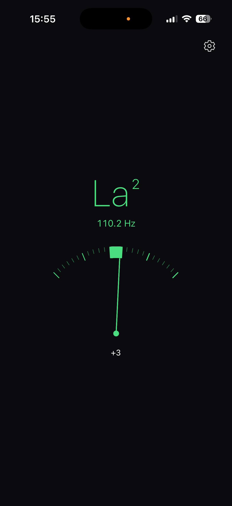
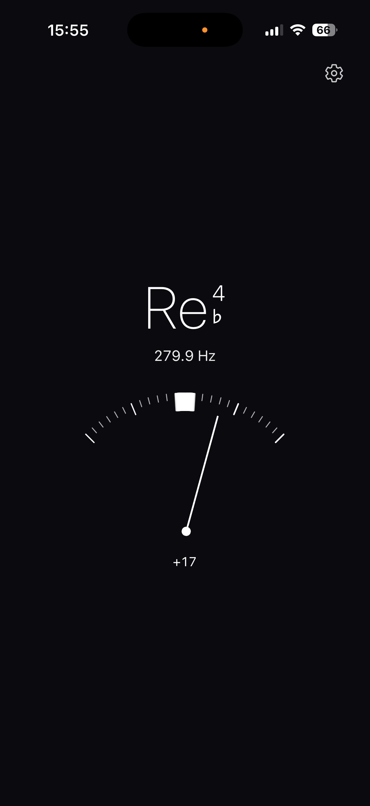
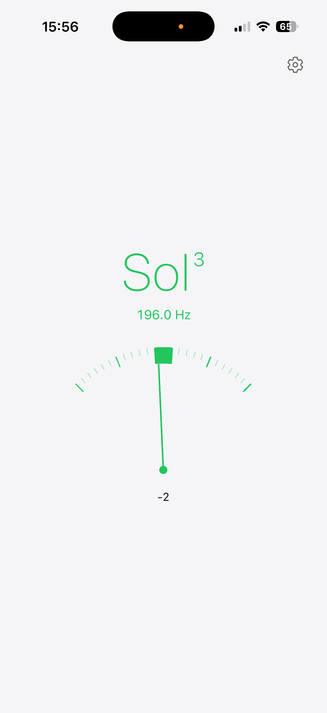
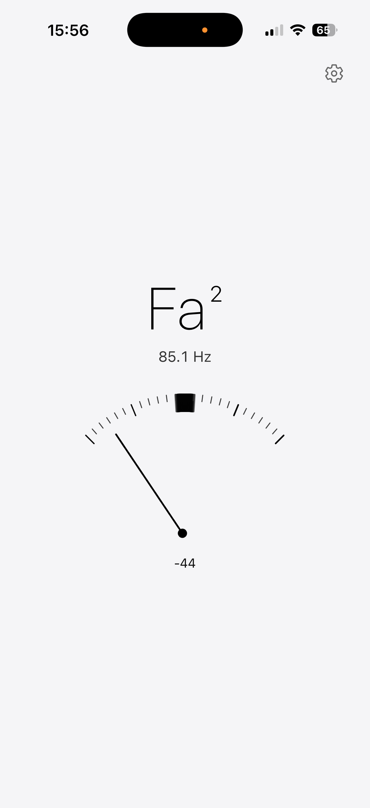
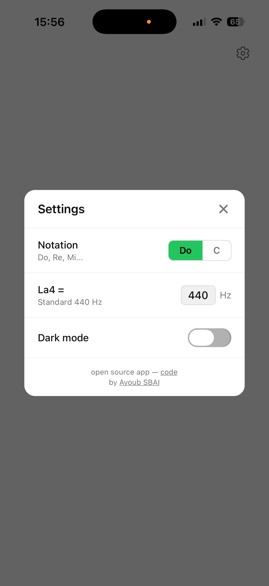
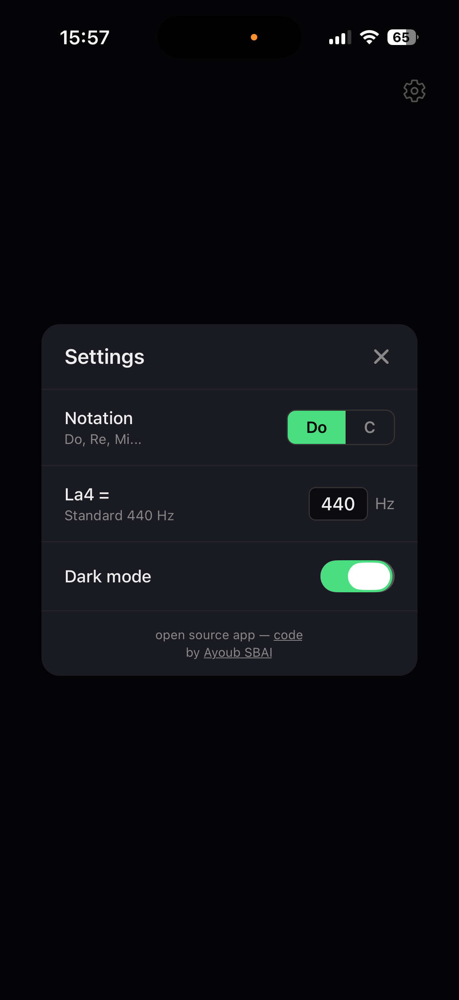

# OneTuner

Just a tuner. Nothing more.

Open the app, play a note, see if you're in tune. No accounts, no ads, no subscriptions, no social features.

## Screenshots

<p align="center">
  
  
  
  
  
  
</p>

## How it works

- Listens to your microphone and detects pitch in real-time
- HPS + YIN hybrid pitch detection with harmonic validation for accuracy
- Displays the nearest note in solfège (Do, Re, Mi...) or letter (C, D, E...) notation with proper accidentals (♭)
- Needle meter shows how many cents sharp or flat you are
- Everything turns green when you're in tune (within ±4 cents)
- Configurable A4 reference frequency for custom calibration
- Dark and light mode
- Starts listening automatically, stops when backgrounded

## Built with

- React Native (Expo) + TypeScript
- [react-native-audio-api](https://github.com/nicoder/react-native-audio-api) for real-time microphone input
- HPS (Harmonic Product Spectrum) + YIN hybrid pitch detection with median filtering and adaptive EMA smoothing

## Run it

```bash
npm install
npx expo prebuild --clean
npx expo run:ios --device      # physical device
npx expo run:ios               # simulator
```

> Requires a development build. Expo Go is not supported (native audio module).

## About this project

This entire app — every line of code, every design decision, every bug fix — was written by [Claude Code](https://claude.ai/claude-code) (Opus 4.6) in a single conversation. The only human involvement was testing on a physical device and providing feedback. No code was written or edited by hand.
